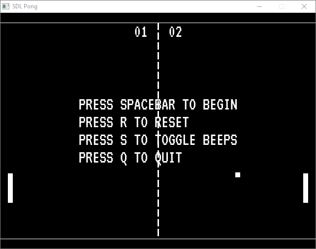
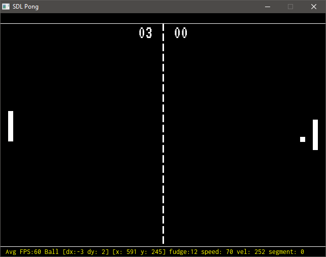
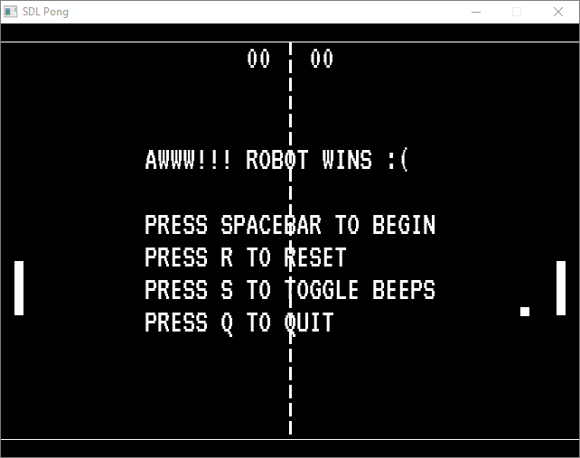

# SDL Pong!
## An Attempt at a Pong Game Clone in C using SDL2

Pong! Everyone knows pong. Many '[how to get started in game dev](https://www.gamedev.net/articles/programming/general-and-gameplay-programming/your-first-step-to-game-development-starts-here-r2976/)' articles
recommend Pong as a first project, since it is 'Simple: input, physics, 
collision detection, sound; scoring'.

So this is my attempt at Pong! Enjoy!







### Known Bugs

* Ball occasionally gets 'stuck' when it intersects the side or end
of the paddle (maybe a 'backhand' feature? :)
* Ball occasionally gets stuck when it intersects the window top or bottom edge

### Features TBD

* Make Robot AI more 'human':
  * Intercept ball with middle of paddle
  * Add an 'overshoot' random factor
  * Move the paddle toward the middle of the screen after a volley
* Add Release build to makefile
* Add packaging and distribution to Makefile (build an installer exe with NSIS?)
* Cross-platform builds?
  * Windows (done)
  * Linux
  * Macintosh

### Features Completed

* Basic ball and paddle movement
* 'Robot' (computer AI) follows and returns ball 
* Score keeping
* Idle screen
* Court edge lines across top and bottom of screen
* Apply 'English' when ball contacts outer sides of paddle or when paddle is moving
* Speed up ball slightly after each volley
* Sound effects
* Use ~~environment variable~~ `L` key to control console logging and 
in-game stats output
* Document code (functions, etc.)
* License (MIT)

## Sound Effects

I used [LabChirp](https://labbed.net/software/labchirp/) to create the paddle, 
point and wall sound effects. 

The associated `.lch` files record the settings 
I used in LabChirp for each effect, based on details about the Pong sounds in [an article](https://stelioskanitsakis.medium.com/an-audio-comparison-between-the-sounds-of-ataris-pong-and-the-silence-of-magnavox-odyssey-s-83e6fac56653) by Stelios Kanitsakis, and by listening to the sound effects in
[this YouTube recording](https://www.youtube.com/watch?v=fiShX2pTz9A&t=14s) of a
Pong match.

## How to Build SDL Pong

Build process only tested on Microsoft Windows 10 with these versions of w64devkit 
and SDL2:
  * w64devkit v1.23.0
  * SDL2-devel-2.30.3-mingw
  * SDL2_image-devel-2.8.2-mingw
  * SDL2_mixer-devel-2.8.0-mingw
  * SDL2_ttf-devel-2.22.0-mingw

Assumes using Microsoft Visual Code as IDE, with C/C++ extension at minimum.

## Instructions
1. Download and install [w64devkit](https://github.com/skeeto/w64devkit) to 
   a convenient location, e.g. `C:\w64devkit`
1. Add  `C:\w64devkit\bin` to system or user PATH
1. Download SDL2 **mingw** (not VC) **development** libraries:
    * [SDL2 main lib](https://github.com/libsdl-org/SDL/releases), e.g. 
    `SDL2-devel-2.30.3-mingw.zip`
    * [SDL_image](https://github.com/libsdl-org/SDL_image/releases), 
      e.g. `SDL2_image-devel-2.8.2-mingw.zip`
    * [SDL_mixer](https://github.com/libsdl-org/SDL_mixer/releases), 
      e.g. `SDL2_mixer-devel-2.8.0-mingw.zip`
    * [SDL_ttf](https://github.com/libsdl-org/SDL_ttf/releases), 
      e.g. `SDL2_ttf-devel-2.22.0-mingw.zip`
1. Unzip and overlay the contents of each zip file to a convenient location 
   e.g. `C:\SDL2\mingw`, so that the main SDL headers are in `C:\SDL2\mingw\include\SDL2`.
1. Add `C:\SDL2\mingw\bin` to the system or user PATH
1. Clone this repository to a local folder, e.g. `C:\Dev\Projects\SDL_Pong`.
1. Adjust the paths to `w64devkit` and the SDL2 libraries in the `*.json` files 
in the .vscode folder.
1. In the `Makefile`, adjust the paths defined for `SDL_PATH` and `W64DEVKIT_PATH`
1. In the `Makefile` for the `dirs:` target, adjust the path `D:\w64devkit\bin\mkdir` 
to the install location of w64devkit (the Windows `mkdir` command doesn't support the `-p` flag, 
and it is built into the Windows cmd shell, so it takes precedence over the 
w64devkit `mkdir` command and fails on the -p flag).
1. Press `F5` to initiate compilation and debugging. Expect the application to
start running in a 640 x 480 window.
1. Press the `L` key to toggle some debugging output along the bottom of the screen.
1. Enjoy!

The SDL2 libraries folder tree should look like this after unpacking:

```
C:\SDL2
+---mingw
|   +---bin
|   |       sdl2-config
|   |       SDL2.dll
|   |       SDL2_image.dll
|   |       SDL2_mixer.dll
|   |       SDL2_ttf.dll
|   |
|   +---include
|   |   \---SDL2
|   |           begin_code.h
|   |           close_code.h
|   |           SDL.h
|   |           ...
|   |           SDL_vulkan.h
|   |
|   +---lib
|   |   |   libSDL2.a
|   |       ...
|   |   |   libSDL2_ttf.la
|   |   |
|   |   +---cmake
|   |       ...
|   |
|   \---share
|   |   ...
```
